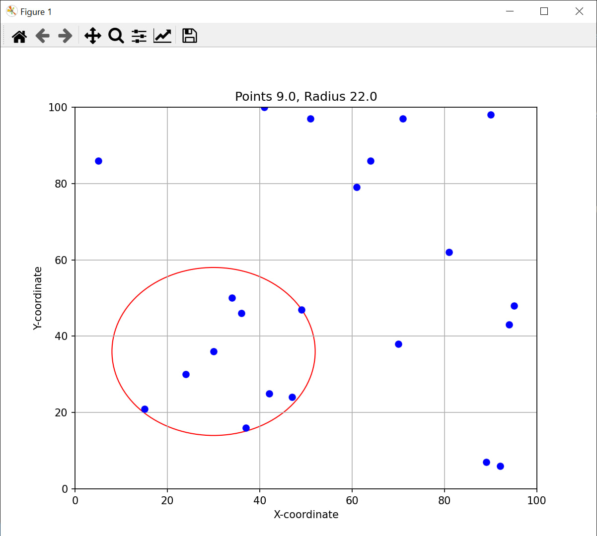

# Овощесборочный Робот

Программа для оптимизации работы робота-сборщика овощей с ограниченным радиусом действия.

## Описание
Робот сборщик имеет ограниченный радиус действия. При вызове программы в качестве входных аргументов используется файл с координатами кустов и радиус действия робота. Программа находит оптимальное место для размещения робота, чтобы собрать максимальное количество овощей.

## Сборка проекта
Для сборки проекта выполните команду `make`. Это соберет и подготовит программу к запуску.

## Тестирование
Вы можете протестировать проект, выполнив команду:
py .\tests\integral_test.py

text

Этот скрипт произведет тестирование программы на краевые ситуации, затем сгенерирует файл с координатами, направит его в исполняемый файл и выведет изображение с результатами.

## Пример изображения

Regenerate Response
